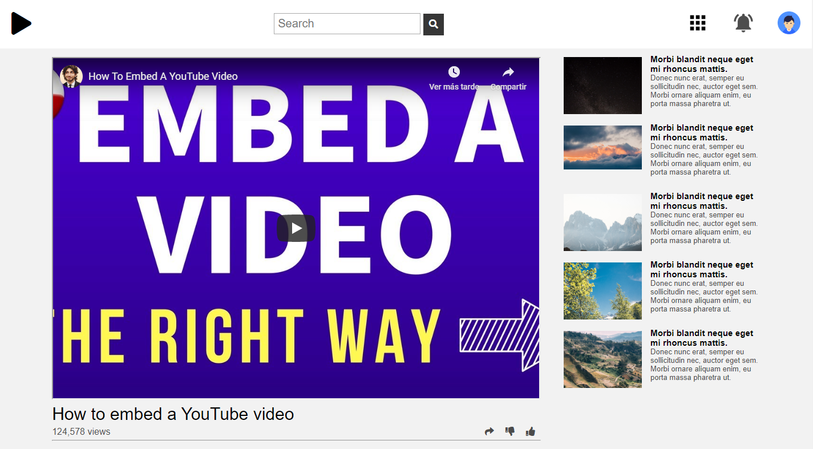

# Embedding Images and Video

> This website was created by Bruna Genz and Oscar Mendoza, as part of the Microverse curriculum. It is similar to a YouTube page.

You can find the original description in [The Odin Project](https://www.theodinproject.com/courses/html5-and-css3/lessons/embedding-images-and-video)
 

## Built With

- HTML, CSS3

## Live Demo

[Live Demo Link](https://rawcdn.githack.com/bruna-genz/youtube-homepage/44fdab9fb3ea76c2311468be2d07853173245ce1/index.html)

## Getting Started

To get a local copy up and running follow these simple example steps.
- open a new terminal and run the next command
- `git clone git@github.com:bruna-genz/youtube-homepage.git`
 
### Prerequisites
- Web browser

## Authors

👤 **Oscar De La Lanza**

- Github: [@oscardelalanza](https://github.com/oscardelalanza)
- Twitter: [@oscardelalanza](https://twitter.com/oscardelalanza)
- Linkedin: [Oscar De La Lanza](https://linkedin.com/in/oscardelalanza)

👤 **Bruna Genz**

- Github: [@bruna-genz](https://github.com/bruna-genz)
- Twitter: [@Bruna_GK](https://twitter.com/Bruna_GK)
- Linkedin: [Bruna Genz](https://www.linkedin.com/in/brunagenz/)

## 🤝 Contributing

Contributions, issues and feature requests are welcome!

## Show your support

Give a ⭐️ if you like this project!
